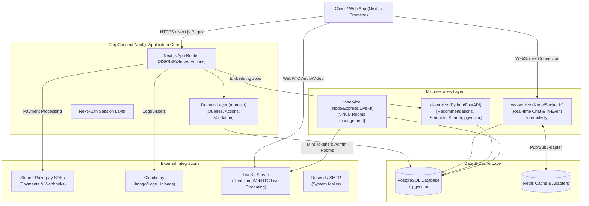

# CorpConnect

> **AI-Powered B2B Collaboration & Networking Graph Platform**
>
> CorpConnect is a next-generation multi-tenant platform designed to help organizations discover, connect, and collaborate through structured relationship graphs, pre-event matchmaking, and real-time interaction systems. 

---

## 🚀 The Vision: Beyond Simple Events

Unlike transactional event portals that focus strictly on ticket sales and static guest lists, **CorpConnect** treats events as **catalysts for strategic connections**. 

The platform is architected around an **Organization-First Networking Graph**:
* **Relationship-driven**: Businesses build persistent organization profiles detailing services, technologies, hiring statuses, and partnership interests.
* **Intelligent Matchmaking**: Vector search similarity analyses identify complementary organizations and propose connections.
* **Pre-Event Coordination**: Attendees can request private 1-on-1 business meetings prior to events starting.
* **Interactive Live Collaboration**: Virtual panels feature real-time WebRTC streams with interactive hand-raising queues, chats, and sentiment polling.

---

## 🏗️ System Topology & Hybrid Architecture

CorpConnect runs a hybrid, multi-tenant monorepo architecture, distributing concerns across specialized runtimes:



### Services Breakdown
1. **Next.js Core Web App**: Main web portal handling server-side rendering (SSR), incremental static regeneration (ISR) for public directories, form validation (Zod), and secure mutations (Server Actions) decoupled into a Domain-Driven `/domain` structure.
2. **WebSocket Service (`ws-service`)**: A stateful Node.js + Socket.io service handling real-time messaging, typing indicators, read receipts, and in-event interactivity (emojis, raise-hand queues). Scales horizontally using a Redis pub/sub adapter.
3. **LiveKit Proxy Service (`lv-service`)**: Node.js Express service wrapping the LiveKit Server SDK. Generates JWT video room tokens, enforces event attendance permissions, and tracks active meeting durations.
4. **AI Microservice (`ai-service`)**: Python/FastAPI service embedding data utilizing `all-MiniLM-L6-v2` and performing vector calculations (`pgvector`) to recommend events, suggest matching partners, search semantically, and perform feedback sentiment analyses.

---

## 💎 Features & Subscription Tier Matrix

CorpConnect enforces multi-layered tier gates across database queries, APIs, and real-time sockets:

| Platform Feature | Free | Pro | Enterprise |
| :--- | :---: | :---: | :---: |
| **Workspace Profile & Switcher** | ✅ | ✅ | ✅ |
| **B2B Filtered Discovery** | ✅ | ✅ | ✅ |
| **Standard Event Registration** | ✅ (max 50 attendees) | ✅ (Unlimited) | ✅ (Unlimited) |
| **Paid Event Gateways** (Stripe/Razorpay) | ❌ | ✅ | ✅ |
| **Direct Messaging (DMs)** | ❌ | ✅ | ✅ |
| **Pre-Event 1-on-1 Matchmaking** | ❌ | ✅ | ✅ |
| **Organization Connections** | ❌ | ✅ | ✅ |
| **AI Partner & Event Recommendations** | ❌ | ✅ | ✅ |
| **External API Key Credentials** | ❌ | ✅ | ✅ |
| **Real-time WebRTC Virtual Rooms** | ❌ | ✅ | ✅ |
| **WhatsApp-style Group Chats** | ❌ | ❌ | ✅ |
| **AI Planner & Event Pitching Flow** | ❌ | ❌ | ✅ |
| **Post-Event Sentiment & Performance Reports**| ❌ | ❌ | ✅ |
| **Semantic Search (`pgvector`)** | ❌ | ❌ | ✅ |
| **Organization Webhook Delivery** | ❌ | ❌ | ✅ (With HMAC Signature) |

---

## 🔒 Governance & Constraints

To keep organizational workspaces compliant, the platform enforces strict business rules at the domain layer:
* **Role Governance**: Organizations are restricted to **exactly 1 Owner** and a **maximum of 5 Admins**. Promotions to OWNER must run through the transactional `transferOrganizationOwnershipAction` to demote the current owner and promote the target atomically.
* **Abuse Prevention**: Free tier organizations are blocked from publishing paid event checkouts, and a 2% (Pro) or 1% (Enterprise) platform commission fee is applied at payment checkouts.

---

## 📁 Monorepo Directory Structure

```text
/
├── actions/             # Legacy and shared server actions
├── ai-service/          # Python FastAPI microservice (embeddings, recommendation engine)
├── app/                 # Next.js App Router (pages, middleware, and API routes)
├── components/          # React components structured by domain (shared, billing, messaging, virtual)
├── constants/           # Platform constants, menu links, metadata
├── data/                # Data Access Layer (DAL) - database reads with permission isolation
├── docs/                # Feature specs, implementation plans, and architecture walkthroughs
├── domain/              # DDD / Vertical Slice Layer (Actions, Queries, Validation, Types)
│   ├── events/
│   ├── messaging/
│   ├── notifications/   # Laravel-style notification dispatcher with multi-adapter system
│   ├── organizations/
│   ├── pitches/         # Event pitching lifecycle schemas & actions
│   └── tags/
├── hooks/               # Client-side hooks (Socket.io subscriptions, intersection observers)
├── lib/                 # Infrastructure clients (Prisma, payment gateways, mailer, job queues)
├── lv-service/          # LiveKit WebRTC rooms management gateway microservice
└── ws-service/          # Socket.io real-time chat service
```

---

## 🛠️ Local Development Setup

### 1. Prerequisites
* **Node.js** 20+ (with `pnpm`)
* **Python** 3.11+ (with `venv`)
* **PostgreSQL** (with the `pgvector` extension installed/enabled)
* **Redis** (for WebSocket scaling and AI cache)

### 2. Database Initialization
From the project root:
```bash
# Enable pgvector in your PostgreSQL instance
npx ts-node scripts/enable-pgvector.ts

# Apply the Prisma schema and generate client
npx prisma db push
```

### 3. Next.js Web Application
```bash
# Install dependencies
pnpm install

# Run the dev server
pnpm dev
```

### 4. WebSocket Service (`ws-service`)
```bash
cd ws-service
pnpm install
# Compile typescript and start
pnpm dev
```

### 5. LiveKit Gateway (`lv-service`)
```bash
cd lv-service
pnpm install
pnpm dev
```

### 6. AI Microservice (`ai-service`)
```bash
cd ai-service
python -m venv .venv
source .venv/bin/activate  # Or .venv\Scripts\activate on Windows
pip install -r requirements.txt

# Run the Uvicorn FastAPI server
uvicorn main:app --reload --port 8000
```
*Note: The first startup of the AI service downloads the `all-MiniLM-L6-v2` model (~90MB) and stores it locally.*

---

## 📧 Notification System

CorpConnect implements a **Factory + Adapter** notification pattern. Job handlers enqueue events (like `SEND_EVENT_REMINDER` or `VIRTUAL_ROOM_OPENED`) which resolve active notification adapters concurrently:
* **Email Adapter**: Relies on Nodemailer/SMTP and logs results in the `EmailLog` table for auditing.
* **In-App Adapter**: Writes directly to the `Notification` table.
* **Slack / Google Chat / SMS Adapters**: Hook into outgoing chat webhook formats.

Add channels by creating an adapter under `domain/notifications/adapters/` and listing it in `registry.ts`.

---

## ⚙️ Environment Variables

Copy the `.env.example` templates in the root, `ws-service`, `lv-service`, and `ai-service` folders. Key environment variables include:

* **Next.js**: `DATABASE_URL`, `AUTH_SECRET`, `AI_SERVICE_MASTER_KEY`, `STRIPE_SECRET_KEY`, `RAZORPAY_KEY_SECRET`, `LIVEKIT_API_KEY`, `NEXT_PUBLIC_WS_URL`.
* **AI Service**: `DATABASE_URL` (uses `asyncpg` scheme: `postgresql+asyncpg://...`), `MASTER_KEY`.
* **ws-service**: `DATABASE_URL`, `REDIS_URL`, `AUTH_SECRET`.
* **lv-service**: `DATABASE_URL`, `LIVEKIT_URL`, `LIVEKIT_API_KEY`, `LIVEKIT_API_SECRET`.

---

## 🛡️ License

This project is proprietary and private software. All rights reserved. Unauthorized redistribution or duplication is strictly prohibited.
