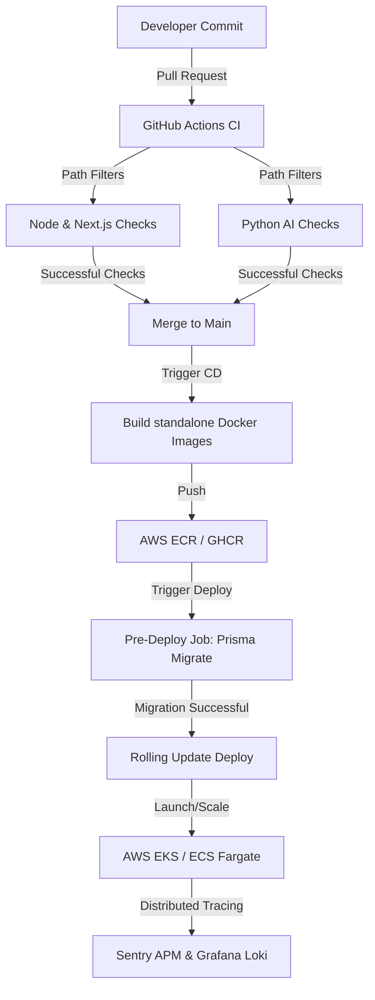

# Implementation Plan: Enterprise-Grade DevOps & Cloud Infrastructure

This document outlines the step-by-step architecture, pipeline configuration, and deployment guidelines to transition the CorpConnect platform from a local-centric deployment model to a highly available, secure, and automated Enterprise DevOps pipeline.

---

## 1. Core Objectives

*   **Zero-Downtime Deployments**: Decouple database migrations from container startup and employ rolling updates.
*   **Path-Filtered Multi-Service CI**: Run testing, linting, and building pipelines only on services that changed (Next.js client, Python AI, WebSocket service, LiveKit wrapper).
*   **Production-Optimized Containers**: Leverage Next.js Standalone builds to reduce container images by over 80%.
*   **Strict Secrets Management**: Migrate credentials out of standard `.env` files into an automated Secret Manager.
*   **Comprehensive Shift-Left Security**: Integrate dependency audits, SAST (Static Application Security Testing), and secret scanners directly into Git workflows.
*   **Distributed Observability**: Hook up Sentry, Prometheus, and central logging across the Next.js and FastAPI runtimes.

---

## 2. Target DevOps & Cloud Architecture

The following diagram illustrates the deployment workflow from GitHub to the running microservices:



---

## 3. CI/CD Pipeline Design

### 3.1 Path-Based Filtering
Currently, the pipeline runs all Node jobs for any pull request. We will separate these pipelines by directory changes to optimize resources and keep CI times under 5 minutes.

#### Proposed `.github/workflows/ci.yml`
```yaml
name: CI Checks

on:
  pull_request:
    branches: [ master, main ]
  workflow_dispatch:

jobs:
  # Next.js & Node services verification
  node-pipeline:
    name: Node.js Services Check
    runs-on: ubuntu-latest
    steps:
      - uses: actions/checkout@v4
      - name: Path Filter Check
        uses: dorny/paths-filter@v3
        id: filter
        with:
          filters: |
            node:
              - 'package.json'
              - 'pnpm-lock.yaml'
              - 'app/**'
              - 'components/**'
              - 'domain/**'
              - 'lib/**'
              - 'ws-service/**'
              - 'lv-service/**'
      
      - name: Set up PNPM
        if: steps.filter.outputs.node == 'true'
        uses: pnpm/action-setup@v4
        with:
          version: 10
          
      - name: Set up Node.js
        if: steps.filter.outputs.node == 'true'
        uses: actions/setup-node@v4
        with:
          node-version: '20'
          cache: 'pnpm'
          
      - name: Install & Verify
        if: steps.filter.outputs.node == 'true'
        run: |
          pnpm install
          pnpm run lint
          pnpm tsc --noEmit
          pnpm prisma validate
          pnpm prisma generate
          pnpm run build
          pnpm test

  # Python AI service verification
  python-pipeline:
    name: Python AI Service Check
    runs-on: ubuntu-latest
    steps:
      - uses: actions/checkout@v4
      - name: Path Filter Check
        uses: dorny/paths-filter@v3
        id: filter
        with:
          filters: |
            python:
              - 'ai-service/**'
              
      - name: Set up Python
        if: steps.filter.outputs.python == 'true'
        uses: actions/setup-python@v5
        with:
          python-version: '3.11'
          cache: 'pip'
          
      - name: Install Linting & Testing Tools
        if: steps.filter.outputs.python == 'true'
        run: |
          python -m pip install --upgrade pip
          pip install ruff pytest mypy -r ai-service/requirements.txt
          
      - name: Run Ruff Linter
        if: steps.filter.outputs.python == 'true'
        run: ruff check ai-service/
        
      - name: Run Mypy Type Checking
        if: steps.filter.outputs.python == 'true'
        run: mypy ai-service/
        
      - name: Run Pytest
        if: steps.filter.outputs.python == 'true'
        run: pytest ai-service/
```

---

## 4. Production Container Optimization

### 4.1 Next.js Standalone Build
By default, Next.js packages all `node_modules` and files, resulting in large, heavy images. We will configure Standalone Output to extract only the files required for production.

1. Add `output: 'standalone'` to `next.config.ts`:
```typescript
import type { NextConfig } from "next";

const nextConfig: NextConfig = {
  output: "standalone",
  /* rest of your config */
};

export default nextConfig;
```

2. Replace the root `Dockerfile` with a multi-stage production runner configuration:

```dockerfile
# ── Stage 1: Install dependencies ──
FROM node:20-alpine AS deps
WORKDIR /app
COPY package.json pnpm-lock.yaml ./
# Install PNPM globally
RUN npm i -g pnpm && pnpm install --frozen-lockfile

# ── Stage 2: Rebuild & Compile ──
FROM node:20-alpine AS builder
WORKDIR /app
COPY --from=deps /app/node_modules ./node_modules
COPY . .
RUN npx prisma generate
ENV NEXT_TELEMETRY_DISABLED=1
RUN npm i -g pnpm && pnpm run build

# ── Stage 3: Runner (Minimal Runtime) ──
FROM node:20-alpine AS runner
WORKDIR /app
ENV NODE_ENV=production
ENV PORT=3000
ENV HOSTNAME="0.0.0.0"

# Create low-privilege system user
RUN addgroup --system --gid 1001 nodejs
RUN adduser --system --uid 1001 nextjs

# Copy standalone build directory
COPY --from=builder /app/public ./public
COPY --from=builder --chown=nextjs:nodejs /app/.next/standalone ./
COPY --from=builder --chown=nextjs:nodejs /app/.next/static ./.next/static

USER nextjs
EXPOSE 3000

CMD ["node", "server.js"]
```

> [!NOTE]
> Standalone output generates a specialized `server.js` inside `.next/standalone` that acts as the entrypoint, bypasses the need for `next start`, and runs without requiring development dependencies.

---

## 5. Decoupled, Zero-Downtime Database Migrations

Running `prisma migrate deploy` at container boot inside scaling service instances leads to schema locks. To resolve this, migrations must be executed as an isolated execution job during deployment.

### 5.1 Pipeline Deployment Workflow (CI/CD CD-Stage)
1. **GitHub CD Stage**: Triggered on merging to main.
2. **Build and Tag**: Build Docker images, pushing them to ECR/GHCR.
3. **Trigger Migration Job**: Run `npx prisma migrate deploy` in a short-lived execution task (e.g. AWS ECS Task, Kubernetes Job).
4. **Deploy Pods/Containers**: Once the migration task successfully exits (exit code `0`), perform a rolling update on the web application pods/containers.

### 5.2 Expand and Contract Migration Pattern
To guarantee zero-downtime during rolling updates:
* **Expand (Phase A)**: Create additive schema changes (e.g., add a column, set it to nullable or default, write values to both fields).
* **Deploy (Phase B)**: Roll out the new code that reads and writes from the new database column.
* **Contract (Phase C)**: Run a clean-up migration to remove the old column after verifying stability.

---

## 6. Infrastructure as Code (IaC) Architecture

We will define platform resources using Terraform or OpenTofu. This ensures environment parity between Dev, Staging, and Production.

### 6.1 Infrastructure Layout
| Resource Class | Service Type | Details |
| :--- | :--- | :--- |
| **Compute VPC** | Public/Private Subnets | Private subnets house database & microservices; public subnets run Load Balancers (ALB) and NAT Gateways. |
| **Containers** | AWS ECS Fargate or EKS | Scales stateless Next.js app, WebSocket service, LiveKit wrapper, and Python AI containers dynamically. |
| **Database** | Managed PostgreSQL (RDS) | High-availability cluster, automated daily snapshotting, replica read pools. |
| **Caching / PubSub** | Managed Redis Cluster | Elasticache Redis cluster for user sessions, caching, and WebSocket state synching. |
| **Media Store** | AWS S3 / Cloudinary | Secure object store for user-uploaded event banners and KYB documents. |

---

## 7. Configuration & Secret Management

No API keys, database URLs, or Sentry DSNs should be baked into Docker images or committed to Git.

### 7.1 Production Integration
* **Secret Injection**: In production, utilize **AWS Secrets Manager** or **HashiCorp Vault**.
* **Kubernetes Orchestration**: Use Kubernetes External Secrets Operator or CSI Secret Store Driver. Secrets are fetched dynamically from AWS Secrets Manager and exposed as environment variables or mounted files inside the container context:
  ```yaml
  # Example Deployment secret mapping snippet
  env:
    - name: DATABASE_URL
      valueFrom:
        secretKeyRef:
          name: corpconnect-db-secrets
          key: url
  ```

---

## 8. DevSecOps (Shift-Left Security)

Integrate checking directly into the PR review step using automated tools in `.github/workflows/security.yml`:

```yaml
name: Security Scan

on:
  push:
    branches: [ master, main ]
  pull_request:

jobs:
  security-audit:
    name: Vuln & Secret Scans
    runs-on: ubuntu-latest
    steps:
      - uses: actions/checkout@v4

      # Secret scanning to prevent credentials commit leaks
      - name: TruffleHog OSS Secret Scan
        uses: trufflesecurity/trufflehog@main
        with:
          path: ./
          base: ${{ github.event.repository.default_branch }}
          head: HEAD

      # Node security dependency check
      - name: Run PNPM Security Audit
        run: pnpm audit

      # Python security dependency check
      - name: Install & Run Python Safety check
        run: |
          pip install safety
          safety check -r ai-service/requirements.txt
```

---

## 9. Observability & APM

### 9.1 Distributed Tracing
Ensure transactional headers (`sentry-trace` and `baggage`) pass successfully across boundary calls.

```
Next.js Frontend (Client)
   │
   ├─► Sentry Trace Header Context
   ▼
Next.js Server Actions / APIs
   │
   ├─► Passes Header Context via HTTP Header
   ▼
Python FastAPI (ai-service)
   │
   ├─► Receives Header & Logs Transaction
   ▼
Prisma ORM / Database Queries
```

### 9.2 Centralized Logging
*   **Logging Output**: All microservices must write structured JSON logs to standard output (`stdout`).
*   **Log Forwarding**: A lightweight agent (e.g. FluentBit, AWS CloudWatch agent, Vector) routes logs to **Grafana Loki** or **Datadog**.
*   **Log Format (Next.js & Python)**:
    ```json
    {"timestamp": "2026-06-30T17:22:34Z", "level": "ERROR", "service": "ai-service", "message": "Failed to generate embedding", "trace_id": "860be7d7-ecff-4769"}
    ```
