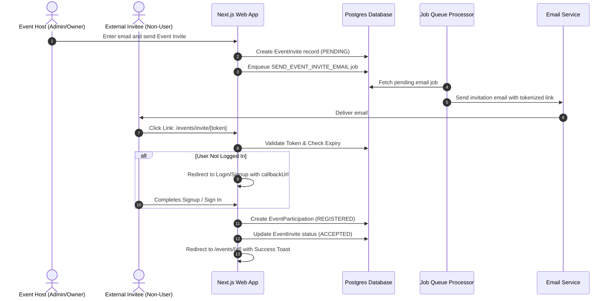

# External Event Invitation Flow (Viral Loop User Acquisition)

This document outlines the detailed implementation plan to add the **External Event Invitation Flow** to the CorpConnect platform. This feature enables event organizers to invite external participants (users who do not yet have an account) to their events. When invitees click the invitation link, they are onboarded to the platform and automatically registered for the target event.

---

## 1. Architectural Workflow

The flow leverages our Next.js App Router, Prisma ORM, and background `JobQueue` to ensure a smooth, decoupled, and secure registration funnel.



---

## 2. Database Schema Changes

We will add a new `EventInvite` model to track pending event invitations. This will be added to `prisma/schema.prisma`.

### Proposed Schema Additions

```prisma
// Update in prisma/schema.prisma

model EventInvite {
  id          String       @id @default(uuid()) @db.Uuid
  eventId     String       @db.Uuid
  email       String
  token       String       @unique
  status      InviteStatus @default(PENDING)
  invitedBy   String       @db.Uuid
  expiresAt   DateTime
  createdAt   DateTime     @default(now())
  updatedAt   DateTime     @updatedAt

  event       Events       @relation(fields: [eventId], references: [id], onDelete: Cascade)
  inviter     User         @relation(fields: [invitedBy], references: [id], onDelete: Cascade)

  @@index([email])
  @@index([token])
  @@index([status, createdAt])
}

// Modify existing models:
// 1. Add relation to User model:
//    eventInvitesSent EventInvite[] @relation("InviterUser")
// 2. Add relation to Events model:
//    invites          EventInvite[]
```

We will also add `SEND_EVENT_INVITE_EMAIL` to the `JobType` enum:
```prisma
enum JobType {
  // ... existing types
  SEND_EVENT_INVITE_EMAIL
}
```

---

## 3. Domain Logic Layer (`domain/events/`)

Aligned with our **Domain-Driven Design (DDD)** structure, we will group these files within the `domain/events/` directory.

### A. Types & Schemas (`domain/events/types.ts` & `validation.ts`)
We define the request schema for sending event invites:
```typescript
import { z } from "zod";

export const SendEventInvitesSchema = z.object({
  eventId: z.string().uuid(),
  emails: z.array(z.string().email("Invalid email address")).min(1, "At least one email is required"),
});

export type SendEventInvitesInput = z.infer<typeof SendEventInvitesSchema>;
```

### B. Queries (`domain/events/queries.ts`)
We need queries to retrieve and validate invitation tokens:
```typescript
import { prisma } from "@/lib/db";

export async function getEventInviteByToken(token: string) {
  return await prisma.eventInvite.findUnique({
    where: { token },
    include: {
      event: {
        include: {
          organization: true,
        },
      },
      inviter: true,
    },
  });
}
```

### C. Actions (`domain/events/actions.ts`)
We add a server action to create invitations, generate unique tokens, and enqueue background email jobs:

```typescript
"use server";

import { prisma } from "@/lib/db";
import { auth } from "@/auth";
import crypto from "crypto";
import { SendEventInvitesSchema } from "./validation";
import { revalidatePath } from "next/cache";

export async function sendEventInvitesAction(rawInput: any) {
  const session = await auth();
  if (!session?.user?.id) {
    return { error: "Unauthorized" };
  }

  const result = SendEventInvitesSchema.safeParse(rawInput);
  if (!result.success) {
    return { error: "Validation failed", details: result.error.format() };
  }

  const { eventId, emails } = result.data;

  try {
    // 1. Verify that the requester belongs to the host organization and has permissions
    const event = await prisma.events.findUnique({
      where: { id: eventId },
      select: { organizationId: true },
    });

    if (!event || !event.organizationId) {
      return { error: "Event not found" };
    }

    const membership = await prisma.organizationMember.findFirst({
      where: {
        userId: session.user.id,
        organizationId: event.organizationId,
        role: { in: ["OWNER", "ADMIN"] },
      },
    });

    if (!membership) {
      return { error: "Forbidden: Only organization admins/owners can invite participants" };
    }

    // 2. Create invites and enqueue background jobs
    const expiresAt = new Date(Date.now() + 7 * 24 * 60 * 60 * 1000); // 7-day expiry

    await prisma.$transaction(async (tx) => {
      for (const email of emails) {
        const token = crypto.randomBytes(32).toString("hex");

        const invite = await tx.eventInvite.create({
          data: {
            eventId,
            email,
            token,
            invitedBy: session.user.id,
            expiresAt,
          },
        });

        // Enqueue background email job
        await tx.jobQueue.create({
          data: {
            type: "SEND_EVENT_INVITE_EMAIL",
            payload: {
              inviteId: invite.id,
              email: invite.email,
              token: invite.token,
            },
          },
        });
      }
    });

    revalidatePath(`/events/${eventId}`);
    return { success: true };
  } catch (error) {
    console.error("Error sending event invites:", error);
    return { error: "Internal server error" };
  }
}
```

---

## 4. Background Job Queue Integration

### A. Job Handler (`lib/jobs/event-invites.ts`)
Create a job handler that retrieves the invite record, compiles the template, and sends the email:

```typescript
import { prisma } from "@/lib/db";
import { sendMail } from "@/lib/mailer";

export async function processEventInviteEmail(payload: { inviteId: string; email: string; token: string }) {
  const invite = await prisma.eventInvite.findUnique({
    where: { id: payload.inviteId },
    include: {
      event: {
        select: {
          title: true,
          id: true,
        },
      },
      inviter: {
        select: {
          name: true,
        },
      },
    },
  });

  if (!invite) {
    throw new Error(`Event invite ${payload.inviteId} not found`);
  }

  if (invite.status !== "PENDING") {
    return; // Already processed
  }

  const inviteUrl = `${process.env.NEXT_PUBLIC_APP_URL}/events/invite/${payload.token}`;
  
  await sendMail({
    to: invite.email,
    subject: `You're invited to attend: ${invite.event.title}`,
    templateType: "EVENT_INVITATION",
    payload: {
      eventName: invite.event.title,
      inviterName: invite.inviter.name || "A colleague",
      inviteUrl,
    },
    html: `
      <h2>You've been invited!</h2>
      <p>${invite.inviter.name || "A colleague"} has invited you to attend the event: <strong>${invite.event.title}</strong>.</p>
      <p>Click below to accept your invitation and join the event:</p>
      <a href="${inviteUrl}" style="background:#2563eb;color:#fff;padding:10px 20px;text-decoration:none;border-radius:5px;display:inline-block;">Accept Invitation</a>
    `,
  });

  await prisma.eventInvite.update({
    where: { id: invite.id },
    data: { status: "SENT" },
  });
}
```

### B. Wire into `job-processor.ts`
Add the case for `SEND_EVENT_INVITE_EMAIL` in `lib/jobs/job-processor.ts`:
```typescript
case "SEND_EVENT_INVITE_EMAIL":
  await processEventInviteEmail(job.payload as any);
  break;
```

---

## 5. Front-End Routing & Acceptance Hook

### Public Invitation Acceptance Route (`app/events/invite/[token]/page.tsx`)
This page handles unauthenticated entries, enforces registration or login, and processes the registration atomically upon login.

```typescript
import { auth } from "@/auth";
import { prisma } from "@/lib/db";
import { redirect } from "next/navigation";
import { Card, CardContent, CardDescription, CardHeader, CardTitle } from "@/components/ui/card";
import { Button } from "@/components/ui/button";
import { CheckCircle2, XCircle, Clock } from "lucide-react";
import Link from "next/link";
import { createEventParticipation } from "@/data/event-participation";

interface EventInvitePageProps {
  params: Promise<{
    token: string;
  }>;
}

export default async function EventInvitePage({ params }: EventInvitePageProps) {
  const session = await auth();
  const userId = session?.user?.id;
  const { token } = await params;

  const invite = await prisma.eventInvite.findUnique({
    where: { token },
    include: {
      event: true,
      inviter: true,
    },
  });

  if (!invite) {
    return (
      <div className="wrapper min-h-screen flex items-center justify-center">
        <Card className="max-w-md w-full">
          <CardHeader>
            <div className="flex justify-center mb-4"><XCircle className="w-16 h-16 text-red-500" /></div>
            <CardTitle className="text-center">Invalid Invitation</CardTitle>
            <CardDescription className="text-center">This invitation link is invalid or has expired.</CardDescription>
          </CardHeader>
        </Card>
      </div>
    );
  }

  if (invite.expiresAt < new Date()) {
    return (
      <div className="wrapper min-h-screen flex items-center justify-center">
        <Card className="max-w-md w-full">
          <CardHeader>
            <div className="flex justify-center mb-4"><Clock className="w-16 h-16 text-orange-500" /></div>
            <CardTitle className="text-center">Invitation Expired</CardTitle>
            <CardDescription className="text-center">This invitation is no longer active.</CardDescription>
          </CardHeader>
        </Card>
      </div>
    );
  }

  if (invite.status === "ACCEPTED") {
    redirect(`/events/${invite.eventId}`);
  }

  // Force login/signup if not authenticated
  if (!userId) {
    redirect(`/login?callbackUrl=/events/invite/${token}`);
  }

  // User is authenticated. Match email verification if needed or auto-process
  try {
    await prisma.$transaction(async (tx) => {
      // 1. Mark invite accepted
      await tx.eventInvite.update({
        where: { id: invite.id },
        data: { status: "ACCEPTED" },
      });
      
      // 2. Add to event participations
      await tx.eventParticipation.create({
        data: {
          eventId: invite.eventId,
          userId,
          status: "REGISTERED",
        },
      });

      // 3. Increment attendee count
      await tx.events.update({
        where: { id: invite.eventId },
        data: {
          attendeeCount: { increment: 1 },
        },
      });
    });

    redirect(`/events/${invite.eventId}?joined=true`);
  } catch (error) {
    console.error("Error accepting event invite:", error);
    return (
      <div className="wrapper min-h-screen flex items-center justify-center">
        <Card className="max-w-md w-full">
          <CardHeader>
            <div className="flex justify-center mb-4"><XCircle className="w-16 h-16 text-red-500" /></div>
            <CardTitle className="text-center">Registration Error</CardTitle>
            <CardDescription className="text-center">An error occurred while linking you to the event.</CardDescription>
          </CardHeader>
        </Card>
      </div>
    );
  }
}
```

---

## 6. UI/UX: Modal on Event Details Page

Add an **Invite Guests** button inside the event detail page (`app/(protected)/events/[id]/page.tsx`) next to registration controls:
- **Organizer Check**: Visible only to the event host's OWNER or ADMIN members.
- **Invite Modal**: An overlay dialogue allowing hosts to enter multiple email addresses separated by commas.
- **Client Action Integration**: Leverages `useTransition` to submit emails via `sendEventInvitesAction()` and shows a loading state.

---

## 7. Migration Sequence

1. **Database update**: Append the models to `schema.prisma`. Run `npx prisma db push` (or create a migration).
2. **Domain layer integration**: Write validations, queries, and Server Actions.
3. **Background Job wiring**: Add job enqueuer and wire it into the `job-processor.ts` worker loop.
4. **Router & Views addition**: Add `/events/invite/[token]` page and the organizer invitation modal.
5. **E2E Testing**: Send an invitation to an external address, log out, visit the link, register, and confirm automatic event RSVP registration.
