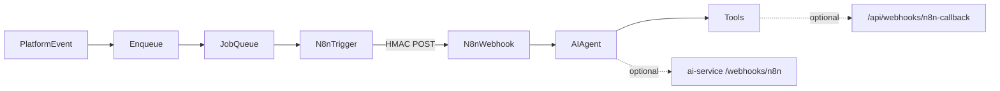

# Phase 5b — Agentic LLM Automation (Implementation Plan)

> **Prerequisite:** Phase 5 webhook automation bus is largely done. See [phase5-implementation-plan.md](./phase5-implementation-plan.md).  
> **Context / why n8n exists:** [n8n-purpose-and-architecture.md](./n8n-purpose-and-architecture.md).  
> **Older sketches:** [implementation-plan.md](./implementation-plan.md) (Step 5.4), [llm-integration-suggestions.md](./llm-integration-suggestions.md), [organization-verification.md](./organization-verification.md).

## Goal

Finish the **agentic** layer on top of the existing CorpConnect → signed webhook → n8n pipeline so that:

1. Org rules can carry a natural-language **`promptTemplate`** (instruction for an n8n AI Agent).
2. n8n workflows can reason over `promptTemplate` + `contextData` and call tools (email, Slack, HTTP).
3. Optionally, n8n can call CorpConnect’s **ai-service** for mid-workflow LLM inference.
4. Known runtime gaps from Phase 5 are closed (`EVENT_CANCELLED`, `filterJson`, env naming, security polish).
5. At least one **sample agent workflow** ships in-repo so ops is not starting from zero.

## Approach (locked)

Keep the current model: **CorpConnect is the event bus; n8n is where workflows and agents live.**

- Org admins select an **`AutomationWorkflowTemplate`** (platform catalog) instead of pasting webhook URLs by default.
- App admins set `webhookUrl` on templates via seed + `/admin/automations`.
- Do **not** build an in-app visual workflow builder or embedded iPaaS in this phase.
- Do **not** add per-org n8n tenancy.
- Do **not** replace AutomationRule with a full HubSpot-style native action catalog (possible later phase).



---

## Current state (baseline)

| Piece | Status |
| --- | --- |
| `AutomationRule` + dashboard CRUD/test | Done |
| `enqueueMatchingRules` + `TRIGGER_N8N_WORKFLOW` | Done |
| HMAC POST in `lib/jobs/n8n-trigger.ts` | Done |
| `POST /api/webhooks/n8n-callback` | Done |
| n8n service in `compose.yaml` | Done |
| Triggers: registration, feedback, connection, meeting, member join | Done |
| `EVENT_CANCELLED` producer | Missing |
| `filterJson` applied at enqueue | Missing (field exists unused) |
| `promptTemplate` on rules | Missing |
| ai-service `POST /webhooks/n8n` | Missing (HMAC helpers only) |
| Sample n8n agent workflow JSON | Missing |
| Env docs (`N8N_SHARED_SECRET` / `N8N_CALLBACK_SECRET`) | Incomplete / drift |

---

## Workstream A — Agent instructions in CorpConnect

### A1. Schema

In `prisma/schema.prisma`, add to `AutomationRule`:

```prisma
promptTemplate String? @db.Text  // NL instruction for n8n AI Agent; optional
```

- Migration: `add_automation_rule_prompt_template`
- Keep nullable so existing rules keep working

### A2. Validation + actions

- Extend `CreateRuleSchema` (and update path if any) in `lib/validation.ts`: optional string, max length (e.g. 2000).
- `actions/automation.actions.ts`: accept/persist `promptTemplate`; include in list/test payloads / returned DTO.
- Types in `lib/types.ts` / `AutomationRuleData` as needed.

### A3. UI

- `components/automation/AddRuleSheet.tsx`: textarea “Agent instruction (optional)” with short helper text pointing at n8n AI Agent usage.
- `AutomationRulesPanel.tsx`: show truncated prompt on rule cards when set.
- Payload preview: include `"promptTemplate": "…"`.

### A4. Outbound job payload

In `lib/jobs/n8n-trigger.ts` (and `N8nJobPayload` if needed):

- Load `promptTemplate` with the rule.
- POST body becomes:

```json
{
  "ruleId": "...",
  "trigger": "EVENT_REGISTRATION",
  "orgId": "...",
  "contextData": { },
  "promptTemplate": "If dietary restrictions are present, email the caterer and thank the attendee.",
  "timestamp": 1234567890
}
```

- HMAC message format: keep stable or version it. Prefer **keeping** current  
  `` `${ruleId}:${trigger}:${orgId}:${timestamp}` ``  
  so existing n8n verify nodes do not break; do not put `promptTemplate` in the signature string unless you bump a signature version header.

**Files:** `prisma/schema.prisma`, migration, `lib/validation.ts`, `actions/automation.actions.ts`, `components/automation/*`, `lib/jobs/n8n-trigger.ts`, `lib/jobs/automation.ts` (types).

---

## Workstream B — Runtime gap fixes

### B1. `EVENT_CANCELLED`

- Find the event cancel/delete path (API or action).
- Call `enqueueMatchingRules("EVENT_CANCELLED", hostOrgId, { eventId, ... })`.
- If no cancel endpoint exists yet, add the minimal producer when cancel is implemented; do not leave UI trigger orphaned.

### B2. `filterJson`

- Define a minimal filter shape, e.g. `{ "contextData.rating": { "gte": 4 } }` or equality on top-level context keys.
- In `enqueueMatchingRules`, after loading ACTIVE rules, skip rules whose `filterJson` does not match `contextData`.
- Document the filter DSL in this folder (short section or comment in `automation.ts`).
- Optional later: filter editor in UI; for 5b, API/create may accept JSON; UI can stay advanced/optional.

### B3. Environment naming

Align on:

| Variable | Used by |
| --- | --- |
| `N8N_SHARED_SECRET` | Next.js → n8n HMAC (`n8n-trigger.ts`) |
| `N8N_CALLBACK_SECRET` | n8n → `/api/webhooks/n8n-callback` |
| `N8N_ADMIN_USER` / `N8N_ADMIN_PASSWORD` | compose n8n basic auth |
| `N8N_WEBHOOK_BASE_URL` | compose `WEBHOOK_URL` |

- Update root `.env.example` (today often only `N8N_WEBHOOK_SECRET`).
- ai-service: either rename `N8N_WEBHOOK_SECRET` → `N8N_SHARED_SECRET` or accept both (alias in `config.py`).

### B4. Security polish

From Phase 5 security table:

- **Replay window:** reject/log if `X-CorpConnect-Timestamp` older than e.g. 5 minutes (primarily enforced inside n8n; optionally document Code node snippet).
- **SSRF:** keep `https://` only; optionally allow-list hosts via `N8N_WEBHOOK_HOST_ALLOWLIST` (comma-separated) checked in `processN8nWorkflow`.
- Do not log full webhook URLs with secrets; hostname-only in UI is already the pattern.

**Files:** cancel route/action, `lib/jobs/automation.ts`, `lib/jobs/n8n-trigger.ts`, `.env.example`, `ai-service/app/config.py`, `ai-service/.env.example`.

---

## Workstream C — Agentic path in n8n (+ optional ai-service)

### C1. Ops runbook (document in-repo)

1. App admin opens n8n (`compose` port 5678).
2. Create workflow: **Webhook** (POST) → **Crypto/Code** (verify `X-CorpConnect-Signature`) → **AI Agent / LLM** (system prompt + `{{ $json.promptTemplate }}` + `contextData`) → tools (Email, Slack, HTTP).
3. Activate → copy Production webhook URL.
4. Org admin: Automation Rules → trigger + paste URL + optional agent instruction → Test.
5. Optional: HTTP tool posts outcome to `/api/webhooks/n8n-callback` with `X-Callback-Secret`.

### C2. Sample workflows

Add directory `docs/llm-integration/n8n-workflows/` with:

| File | Purpose |
| --- | --- |
| `registration-ops-agent.json` | Webhook → (verify) → AI Agent using `promptTemplate`; stub/demo tools or IF branches for dietary-style logic |
| `README.md` | Import steps, required credentials, expected CorpConnect payload shape, HMAC verify notes |

Optional second sample (later): org legitimacy sketch linking [organization-verification.md](./organization-verification.md) — scrape → LLM score → callback (can stay doc-only until KYB APIs exist).

### C3. Optional — ai-service inference webhook

Enable n8n to use CorpConnect’s hosted LLM instead of (or in addition to) OpenAI-inside-n8n.

**Endpoint:** `POST /webhooks/n8n` on ai-service  
**Auth:** HMAC with shared secret (reuse helpers in `ai-service/app/llm.py`)  
**Body (example):**

```json
{
  "task": "generate_email" | "evaluate_condition" | "freeform",
  "prompt": "...",
  "context": { }
}
```

**Response:** `{ "ok": true, "output": "..." }`

- New router `ai-service/app/routers/webhooks.py`; register in app main.
- Wire only if you want CorpConnect-controlled models/cost; otherwise n8n’s native LLM nodes are enough for MVP agentic demos.

**Files:** `ai-service/app/routers/webhooks.py`, app include router, config/env examples; n8n sample HTTP node pointing at ai-service.

---

## Workstream D — Docs & tracking

- Keep this file as the source of truth for Phase 5b.
- Update [tasks.md](./tasks.md) with a **Phase 5b** checklist (mirror sections A–C).
- Cross-link from [phase5-implementation-plan.md](./phase5-implementation-plan.md) (short “see also Phase 5b” note) when editing that file.
- Do not duplicate outdated `promptTemplate` snippets from old plans without marking them superseded.

---

## Non-goals

- Embedded Zapier/n8n builder inside CorpConnect UI
- Per-organization isolated n8n instances
- Native first-party action catalog (Slack OAuth “one-click notify”) — valid product follow-up, separate project
- Auto-generating n8n workflow graphs from the dashboard

---

## Suggested implementation order

| Step | Work | Outcome |
| --- | --- | --- |
| 1 | A1–A4 `promptTemplate` end-to-end | Rules can send NL instructions to n8n |
| 2 | B3 env alignment | Local/prod config unambiguous |
| 3 | C1–C2 sample workflow + runbook | Demo agentic path without new ai-service code |
| 4 | B1–B2 `EVENT_CANCELLED` + `filterJson` | Trigger taxonomy and filters honest |
| 5 | B4 security allow-list / replay docs | Hardening |
| 6 | C3 ai-service `/webhooks/n8n` (optional) | Hosted LLM mid-workflow |
| 7 | D tasks.md / phase5 cross-links | Tracking |

---

## Acceptance criteria

- [ ] Org admin can save an optional `promptTemplate` and it appears in the n8n POST body.
- [ ] Existing ACTIVE rules without a prompt still fire successfully.
- [ ] At least one imported sample workflow receives a Test rule payload and completes (or clearly documents required credentials).
- [ ] `.env.example` documents `N8N_SHARED_SECRET` and `N8N_CALLBACK_SECRET`.
- [ ] `EVENT_CANCELLED` either enqueues from a real cancel path or is removed/hidden from UI until wired.
- [ ] `filterJson` either filters enqueue or is documented as unused and stripped from create API (prefer: **filters**).
- [ ] (Optional) ai-service `/webhooks/n8n` returns LLM output under HMAC auth.

---

## Key file index

| Area | Path |
| --- | --- |
| Schema | `prisma/schema.prisma` |
| Enqueue | `lib/jobs/automation.ts` |
| Trigger job | `lib/jobs/n8n-trigger.ts` |
| Actions / UI | `actions/automation.actions.ts`, `components/automation/*` |
| Callback | `app/api/webhooks/n8n-callback/route.ts` |
| Compose | `compose.yaml` |
| AI service (optional) | `ai-service/app/llm.py`, new `routers/webhooks.py` |
| Sample workflows | `docs/llm-integration/n8n-workflows/` |
| Purpose doc | `docs/llm-integration/n8n-purpose-and-architecture.md` |
