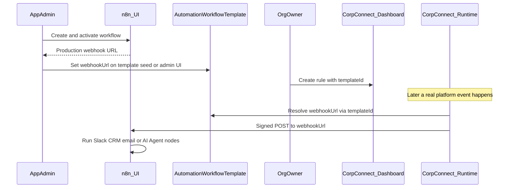
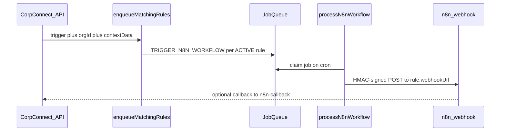
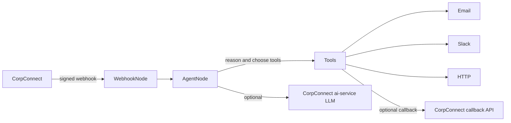

# What n8n is for in CorpConnect

> Related: [phase5-implementation-plan.md](./phase5-implementation-plan.md) (webhook bus) · [n8n-agentic-implementation-plan.md](./n8n-agentic-implementation-plan.md) (Phase 5b agentic completion)

## Short answer

CorpConnect includes n8n so the platform can **react to business events with custom follow-up work outside the app**. CorpConnect stays the source of truth for “something happened”; n8n is the **bring-your-own automation engine** that does things like Slack alerts, CRM updates, welcome emails, or multi-step agentic flows—without hardcoding each integration into Next.js.

In the LLM roadmap this sits as **Phase 5: Agentic Workflows** — move AI from “answers questions” to “takes action” via workflows.

---

## Industry standard: how SaaS products usually do automation

There is no single “one true way,” but products converge on a few patterns. CorpConnect is primarily an **outbound webhook bus** with a **platform-seeded workflow catalog** so org admins pick named templates instead of pasting raw n8n URLs.

### 1. Native in-app workflows (most common for productized SaaS)

Examples: HubSpot Workflows, Salesforce Flow, Notion Automations, Linear Automations.

- User stays **inside your app**.
- You ship curated **triggers** and **actions** (send email, post Slack, update field, webhook).
- No separate n8n UI for the customer; your backend runs the automation.
- **Standard when** automation is a core product feature for non-technical org admins.

### 2. Outbound webhooks / event subscriptions (developer / BYO automation)

Examples: Stripe webhooks, GitHub webhooks, Shopify webhooks, Clerk webhooks.

- Your app emits signed events to a URL the customer configures.
- Customer (or their IT) connects that to **Zapier / Make / n8n / custom code**.
- Your product does **not** build their Slack/CRM logic; you only guarantee a reliable event bus.
- **Standard when** you want flexibility without owning every integration.
- CorpConnect’s original `AutomationRule.webhookUrl` model matched this; the preferred path is now catalog templates (below).

### 3. Embedded iPaaS (self-serve builder branded as yours)

Examples: Zapier Embed, Workato Embedded, Tray Embedded, n8n-style embed/white-label, Pipedream Connect.

- Org admin opens a builder **inside or beside** your product and wires trigger → actions themselves.
- You provide CorpConnect triggers/actions as connectors; the iPaaS runs the graph.
- **Standard when** you want Zapier-like power without building a workflow engine from scratch.
- Heavier (cost, UX, multi-tenant security) than plain webhooks.

### 4. One-click templates / OAuth integrations

Examples: “Connect Slack” → toggle “Notify on new registration”.

- User does not design a graph; they enable a **prebuilt** automation after OAuth.
- You (or partners) maintain the templates.
- **Standard for** the top 5–10 integrations customers expect.

### 5. Services / ops-built automations (early stage or enterprise)

- Customer requests an automation; **your team** builds it in n8n/Workato.
- Customer may only flip a rule on or never touch a builder.
- **Standard for** early platforms and custom enterprise deals — not usually marketed as self-serve no-code.

### Where CorpConnect sits vs what “standard self-serve” looks like

| Expectation | Industry self-serve | CorpConnect today |
| --- | --- | --- |
| Who builds the logic? | Org admin in your UI or embedded builder | App admin in n8n (shared catalog) |
| What org admin configures | Trigger + actions / template | Trigger + **workflow template** dropdown (+ optional prompt) |
| Who runs the actions? | Your engine or embedded iPaaS | External n8n |
| Honest label | Automations / Workflows | Catalog-backed event subscriptions to n8n |

Org admins no longer need the raw webhook URL for the normal path. App admins still build n8n workflows and register their production URLs on `AutomationWorkflowTemplate` (seed + `/admin/automations`).

### What teams usually pick by stage

- **MVP / early:** outbound webhooks only (#2), maybe one shared n8n for demos (#5).
- **Product feature for org admins:** native triggers + a few first-party actions, or templates (#1 / #4).
- **Power users / enterprise:** keep webhooks + optionally embed Zapier/n8n (#2 + #3).

---

## Critical clarification: dashboard rule ≠ n8n workflow

**Someone with n8n access must still create the real workflow in n8n.** Creating a rule on the org dashboard does **not** create n8n nodes. What changed is the handoff: org admins pick a **catalog template** instead of pasting a URL.

What the org owner creates in CorpConnect is an **AutomationRule**:

- a name
- a trigger (e.g. `EVENT_REGISTRATION`)
- a **`templateId`** pointing at `AutomationWorkflowTemplate` (preferred)
- optional agent instruction (`promptTemplate`)
- optional **custom webhook URL** (advanced / BYO escape hatch)

So the honest product shape today is:

| Role | What they do |
| --- | --- |
| **App admin** | Build workflow in n8n → activate → set production webhook URL on the template (`pnpm db:seed` + `/admin/automations`) |
| **Org owner** | Org dashboard → Add Rule → pick trigger + template (+ optional prompt override) |
| **CorpConnect app** | On trigger, resolve `template.webhookUrl` and POST a signed payload |

Without an active template (or custom URL), the rule has nowhere useful to send data.

---

## How it is meant to work (ops handoff)

Concrete example — “Registration Ops Agent”:

1. **App admin** imports [`n8n-workflows/registration-ops-agent.json`](./n8n-workflows/registration-ops-agent.json), activates it, copies the production URL.
2. **App admin** opens `/admin/automations` (or updates seed data) and sets that URL on the `registration-ops-agent` template.
3. **Org owner** adds a rule: trigger = New Event Registration → template = Registration Ops Agent → optional prompt override → save.
4. Someone registers → CorpConnect enqueues `TRIGGER_N8N_WORKFLOW` → job resolves template URL → POST → n8n runs.

---

## Why it was planned (product intent)

From [phase5-implementation-plan.md](./phase5-implementation-plan.md) and [llm-integration-suggestions.md](./llm-integration-suggestions.md):

- Org owners get a **no-code automation layer** *in CorpConnect* for choosing **when** to fire — not a full workflow editor.
- n8n then runs arbitrary nodes (Slack, email, HTTP, CRM, LLM decision nodes, etc.).
- New integrations do **not** require app code releases — only a new n8n workflow + a dashboard rule pointing at it.

Concrete examples:

- Notify Slack when someone registers
- Update CRM when a partnership connection is accepted
- Welcome / onboarding sequence when a member joins
- Dietary-restriction registration → email caterer + thank attendee (agentic example from suggestions)

---

## How the runtime works in code

1. **Org admin UI** — [`AutomationRulesPanel`](../../components/automation/AutomationRulesPanel.tsx); create rules in [`AddRuleSheet`](../../components/automation/AddRuleSheet.tsx) via **template dropdown**.
2. **Platform event** — calls [`enqueueMatchingRules`](../../lib/jobs/automation.ts).
3. **Job** — [`processN8nWorkflow`](../../lib/jobs/n8n-trigger.ts) resolves `template.webhookUrl` (or custom URL), HMAC-signs, and POSTs.
4. **n8n** — self-hosted in [`compose.yaml`](../../compose.yaml); app admin builds the workflow and registers the URL on the template (`/admin/automations`).
5. **Optional callback** — [`n8n-callback`](../../app/api/webhooks/n8n-callback/route.ts) updates run status.

**Triggers wired today:** `EVENT_REGISTRATION`, `FEEDBACK_RECEIVED`, `CONNECTION_ACCEPTED`, `MEETING_SCHEDULED`, `NEW_MEMBER_JOINED`, `EVENT_CANCELLED` (on event delete).

---

## What CorpConnect owns vs what n8n owns

| CorpConnect (built) | n8n (manual / bring-your-own) |
| --- | --- |
| Detect events and enqueue jobs | Workflow graph / business logic |
| Store AutomationRules + run stats | Slack / email / CRM / API nodes |
| Sign outbound webhooks | Validate signature; do the work |
| Dashboard CRUD + test button | Any agentic LLM steps *inside* the workflow |
| Does **not** create n8n workflows | Must be built and activated by someone with n8n access |

---

## How “agentic AI” with n8n was supposed to work

### Product vision

From [llm-integration-suggestions.md](./llm-integration-suggestions.md): organizers define natural-language automations, e.g. *“If someone registers for my event and indicates dietary restrictions, automatically email the caterer… and reply to the attendee…”*

The idea was **not** that CorpConnect’s chat LLM runs the automation. Instead:

1. CorpConnect fires the event (registration payload).
2. n8n receives it.
3. An **LLM / AI Agent node inside n8n** reads the context + instruction, decides what to do, and chooses tools/actions.
4. n8n executes those actions (email, Slack, HTTP APIs).

That is “agentic” in the industry sense: **LLM as decision/brain, workflow tool as hands**.

### Typical n8n agentic pattern

Inside n8n you usually wire:

1. **Webhook** — receives CorpConnect’s `{ trigger, orgId, contextData, timestamp }`.
2. **AI Agent / LLM node** (OpenAI, Anthropic, or HTTP to your own model).
3. **Tools** — Send Email, Slack, HTTP Request, IF/Switch branches.
4. Optionally **HTTP back to CorpConnect** — status updates, or a planned `ai-service` inference endpoint.

Two common flavors:

- **Deterministic + LLM assist:** fixed steps (scrape → score → branch); LLM only writes copy or a score (see [organization-verification.md](./organization-verification.md)).
- **True agent:** LLM chooses which tools to call dynamically (dietary-restriction example).

### What older plans added on top

[implementation-plan.md](./implementation-plan.md) Phase 5 sketched:

- A `promptTemplate` on each AutomationRule (natural-language task for the agent).
- Job posts that template **with** the event payload to n8n.
- An **ai-service** route `POST /webhooks/n8n` so mid-workflow n8n could call CorpConnect’s LLM.

### What is actually built today

| Planned agentic piece | Status |
| --- | --- |
| CorpConnect → n8n signed webhook on triggers | Built |
| `AutomationWorkflowTemplate` catalog + org dropdown | Built |
| AutomationRule with `templateId` / optional custom URL | Built |
| `promptTemplate` on rules / NL instructions | Built |
| ai-service `POST /webhooks/n8n` for mid-run LLM | Built (HMAC uses `N8N_SHARED_SECRET`) |
| Sample n8n agent workflows in repo | Built (`n8n-workflows/`) |
| LLM “brain” deciding actions | Lives **inside n8n nodes** — not CorpConnect runtime |

Agentic behavior still requires an AI Agent / LLM node inside the n8n workflow pointed at by the template.

### Plain example (dietary restrictions)

1. Attendee registers; CorpConnect POSTs `contextData` to the webhook.
2. n8n AI Agent prompt: “If dietary needs present, notify caterer and thank attendee; else no-op.”
3. Agent calls Email tools based on the payload.
4. Optional: agent calls CorpConnect/ai-service only if you wire that HTTP tool.

Without steps 2–3 in n8n, there is no agent — just a dumb webhook hit.

---

## Practical takeaway

- **Today’s model:** CorpConnect = event bus + **seeded workflow catalog** + org rules; n8n = where app admin builds the graph.
- **Org “creating a workflow”** means **subscribing a trigger to a catalog template** (not authoring n8n nodes). Advanced BYO custom webhook remains available.
- App admin rotates webhook URLs centrally on `AutomationWorkflowTemplate` without touching every org rule.
- Value still requires real n8n workflows activated and template URLs updated from seed placeholders.

---

## Gaps worth knowing

- Host allow-list / server-side replay window still optional hardening
- Purpose of n8n nodes still lives outside CorpConnect (no auto-provision of workflows)
- Seeded template webhook URLs are placeholders until app admin sets production URLs in `/admin/automations`
- Separate feature: `ORG_WEBHOOK_DELIVERY` is org API webhooks, not Automation Rules
