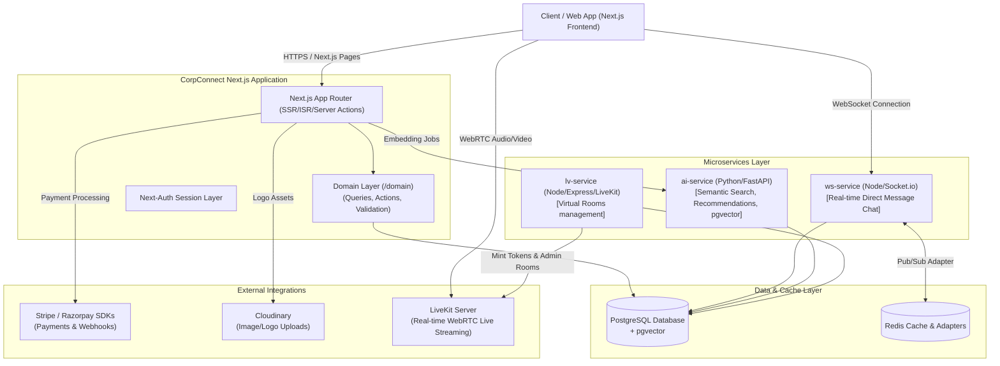

# Architectural Review: CorpConnect B2B Networking Platform
**Prepared by**: Senior Solutions Architect  
**Date**: May 27, 2026  
**Context**: Evaluation of Next.js, NestJS, and Laravel for B2B Networking Architectures

---

## Executive Summary

Your decision to build **CorpConnect** as a **B2B Networking Graph** rather than a transactional "Eventbrite clone" is strategically brilliant. As outlined in `docs/b2b_platform_differentiation.md`, events in a B2B context are *catalysts for connections*, not the end product itself. The value lies in **organization discovery, relationship building, real-time collaboration, and pre-event matchmaking**.

This architectural review evaluates whether **Next.js** was the correct core technology choice for this vision, comparing it to **NestJS (TypeScript)** and **Laravel (PHP)**. 

### The Verdict
* **The frontend and public discovery layer choice of Next.js is 100% CORRECT.** B2B applications live and die by public-facing SEO (discoverability of organizations, public consortiums, and upcoming hybrid panels). Next.js’s Server-Side Rendering (SSR) and Incremental Static Regeneration (ISR) are unmatched here.
* **The distributed service boundary design is OUTSTANDING.** Your choice to offload stateful, real-time messaging to a specialized WebSocket server (`ws-service`), video gating to a LiveKit proxy (`lv-service`), and heavy vectors to a FastAPI engine (`ai-service`) prevents Next.js from becoming an overloaded monolith.
* **The Domain-Driven Design (DDD) migration is MANDATORY.** Next.js lacks inherent backend architecture. The transition to `/domain` (Actions, Queries, Validation) is the exact remedy needed to prevent Next.js from devolving into an unmaintainable codebase.

---

## 1. System Architecture Map

To understand the system under review, let's visualize the current multi-tenant, microservice-hybrid topology of **CorpConnect**:

---

## 2. Framework Comparison Matrix

Here is an objective, comparative review of **Next.js**, **NestJS**, and **Laravel** across the specific parameters required for a B2B Networking Platform.

| Evaluation Metric | Next.js (App Router + Server Actions) | NestJS (Node.js) | Laravel (PHP) |
| :--- | :--- | :--- | :--- |
| **SEO & Indexability** | **Exceptional** (Native SSR/ISR/Streaming rendering built-in). | **Poor** (Requires building a separate frontend consumer). | **Moderate to Good** (Excellent Blade/Inertia SSR, but requires separate Node server running). |
| **B2B Networking Domain Logic** | **Moderate** (Relies on developer self-discipline; resolved by the new DDD migration). | **Exceptional** (Enforces strict modular clean architecture out of the box). | **Exceptional** (Incredible native ORM, database migrations, and structural abstractions). |
| **Real-time Engine Integration** | **Poor** (Serverless routes/Edge runtimes cannot handle persistent WebSockets). | **Exceptional** (Native Socket.io, Microservices, and Redis support). | **Exceptional** (Laravel Reverb / Pusher integrations work flawlessly). |
| **Asynchronous Job Queues** | **Basic** (Requires writing manual loops or relying on cron like `node-cron`). | **Exceptional** (BullMQ integration for Redis works seamlessly). | **Exceptional** (Best-in-class native Queue system with Redis/DB drivers). |
| **B2B Subscription & Billing** | **Manual Integration** (Requires writing custom Stripe/Razorpay webhooks & web controllers). | **Manual Integration** (No built-in wrapper, pure SDK implementation). | **Out-of-the-Box** (Laravel Cashier provides complete multi-plan subscriptions instantly). |
| **Developer Velocity & Type-Safety** | **Exceptional** (Zero-API layer frontend-to-backend TypeScript integration). | **High (Backend only)** (Requires constant API contract syncing with frontend). | **Exceptional** (Amazing ecosystem, but requires context-switching out of JavaScript). |

---

## 3. In-Depth Evaluation

### Option A: Next.js (The Current Core)

#### The Good
1. **SEO as a Growth Engine**: In B2B, a massive portion of organic traffic comes from search engines indexing public organization profiles, portfolio services, and open partnership listings (e.g., *"SaaS logistics companies looking for partners"*). Next.js's ability to render these dynamically via Server-Side Rendering (SSR) and cache them at the edge via **Incremental Static Regeneration (ISR)** is a massive advantage.
2. **Unified Type System**: Next.js allows you to share Zod schemas (`validation.ts`) and TypeScript interfaces (`types.ts`) between the client forms, server-side data mutations (Server Actions), and database schemas. Because the `ws-service` and `lv-service` are also written in TypeScript, you can share types across systems with minimal friction.
3. **Optimized Initial Load (FCP)**: By executing data fetching directly inside Server Components (Phase 6 of your architectural strategy), you bypass client-side React loading spinners, providing an instantaneous, professional B2B desktop experience.

#### The Bad & The Solutions
1. **The Architecture Trap**: Next.js is unopinionated. It is very easy to write spaghetti code where UI components call Prisma models directly.
   * *Solution*: Your migration to a **Domain-Driven Design (DDD)** folder structure (`/domain/events`, `/domain/organizations`) is the perfect cure. It isolates business rules, keeping routing and presentation strictly decoupled.
2. **Stateless Runtime Limitation**: Next.js Serverless or Edge functions cannot maintain active WebSocket channels.
   * *Solution*: You made the correct architectural trade-off by breaking out `ws-service` into a standalone Node.js process using a Redis adapter. This keeps the Next.js process lightweight and scalable.

---

### Option B: NestJS (TypeScript Alternative)

#### The Good
1. **Structural Rigor**: NestJS is built on the angular-architecture philosophy. It provides modular separation of concerns using Dependency Injection (DI) out-of-the-box. If you want a standard, highly disciplined backend codebase that accommodates a massive engineering team, NestJS is king.
2. **Microservice Native**: If your backend were built with NestJS, the core HTTP APIs, the `ws-service` (WebSockets), and the `lv-service` (LiveKit gateway) could have been modules inside a single NestJS monorepo, sharing authentication guards, interceptors, and database adapters natively.

#### The Bad
1. **Frontend Disconnection**: NestJS is strictly a backend framework. Selecting NestJS means you *still* have to write a separate client application. You would either build a separate Next.js SPA (doubling your build, deployment, and configuration overhead) or build a client-side React app that completely sacrifices SEO (which is unacceptable for B2B discovery pages).

---

### Option C: Laravel (PHP Alternative)

#### The Good
1. **Unmatched "Batteries-Included" Ecosystem**: Laravel is a developer's paradise for B2B. Features that you had to build manually:
   * A custom job queue engine (`job-processor.ts` / `lib/jobs/*`).
   * An email logging and SMTP tracking database system (`EmailLog` table / `lib/mailer.ts`).
   * API HMAC signatures (`ApiCredential` model in Phase 7).
   * Webhook delivery and retry logic.
   * Stripe / Razorpay multi-tier subscription portals.
   All of these are solved natively by Laravel features (Queues, Mail, Cashier, Sanctum).
2. **Monolithic Velocity**: With **Laravel Inertia.js**, you could have built a React SPA with a backend entirely controlled by Laravel, eliminating the API layer.

#### The Bad
1. **Language Context-Switching (Polyglot Overhead)**: Since your AI engine (`ai-service`) is Python and your real-time media is node-based (LiveKit SDK integration), adding PHP would mean your engineering team would have to maintain *three* different runtimes and syntax models (PHP + TypeScript + Python).
2. **Lack of React Server Components (RSC)**: Next.js’s cutting-edge React 19 capabilities (streaming components, Suspense, action transition states, and zero-bundle server components) are not natively available in Laravel. 

---

## 4. Key Solutions Architect Findings

Based on an audit of your source code:

1. **Abuse Prevention & Business Gating (Phase 6)**: Your multi-tiered billing checks are beautifully designed. Blocking paid features (`PLATFORM/EXTERNAL`) for `FREE` tier organizations, enforcing the 50-attendee cap, and applying platform fees at checkout are highly robust solutions. Enforcing these layers at the database/data-access level (rather than just UI buttons) shows strong architectural maturity.
2. **Async Job Processor Architecture**: Your queue system in `job-processor.ts` handles tasks like HMAC webhook deliveries and email receipts. However, as CorpConnect scales, running this in-process on Node.js using basic timers or cron scripts will create bottlenecks.
3. **AI recommendations (Phase 7)**: The decoupling of `ai-service` into FastAPI using `pgvector` and `all-MiniLM-L6-v2` is brilliant. It allows your Next.js application to remain focused on web delivery while the memory-heavy vector embeddings are processed in a Python runtime (which is the native ecosystem for AI/ML).

---

## 5. Architectural Recommendations

### Recommendation 1: Stick to the Next.js + Microservice Hybrid Strategy
**Do not rewrite to Laravel or NestJS.** Your current hybrid setup (Next.js for web/SEO + Node.js for WebSockets + FastAPI for AI) leverages the absolute best tool for each specific job. 
* Next.js provides the **SEO and lightning-fast FCP** you need for organic B2B discovery.
* The separate microservices solve the **stateful real-time requirements** (WebSockets, WebRTC live video) without bogging down the main web app.

### Recommendation 2: Double Down on the DDD / Vertical Slice Migration
Next.js works best when structured like an enterprise backend application. 
* Ensure *all* Prisma interactions are strictly banned from UI pages and components.
* Ensure they only interface with the exported API of `/domain`. This gives you the structural discipline of NestJS without the overhead of maintaining two separate repositories.

### Recommendation 3: Evolve your Async Job Processor
Currently, your background jobs (like sending invoices, connection notifications, and webhooks) are driven by in-memory cron or custom scripts. 
* As your active users increase, look into migrating your backend queues to a structured queue processor. Since you are using Redis for Socket.io state in `ws-service`, you can easily integrate **BullMQ** or **Inngest** to process background jobs asynchronously outside of your main Next.js server loop.

---

> [!NOTE]
> **Summary Judgment**: Your technical choices align perfectly with modern B2B SaaS architectural patterns. The hybrid architecture (Next.js + Node Microservices + FastAPI) provides an extremely premium developer experience, unmatched SEO capabilities, and outstanding vertical scalability. The current path is optimal.
