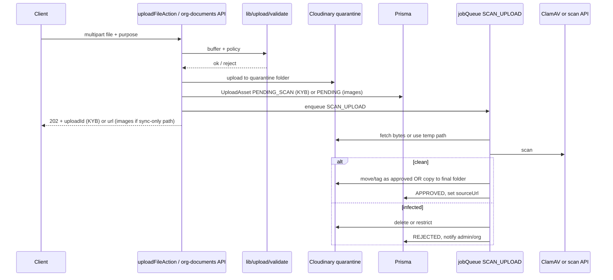

# File Upload Security & Malware Scanning Plan

**Context**: Evently (CorpConnect) — Cloudinary-backed uploads via `uploadFileAction` and `/api/org-documents/upload`  
**Date**: August 6, 2026  
**Status**: Draft — not implemented

---

## Executive summary

Today, uploads are protected by **authentication**, **size limits**, and **partial MIME checks** (KYB only). There is **no malware scanning**, **no magic-byte validation**, and **general image uploads** rely on client `accept` attributes with a caller-controlled Cloudinary `folder`.

This document proposes a **phased hardening plan**: central server-side validation, purpose-based policies, quarantine storage, async malware scanning (especially for KYB), and gated downloads for sensitive documents.

---

## 1. Goals and non-goals

### Goals

- Single server-side gate for all uploads (images + KYB PDFs).
- **Content-based** type detection (magic bytes), not `file.type`.
- **Explicit upload policies** per use case (avatar, event image, org logo, KYB doc).
- **Malware scan** before a file is treated as “published” (especially KYB).
- Quarantine + audit trail for failed scans.
- Rate limits per user/org on upload endpoints.

### Non-goals (v1)

- Replacing Cloudinary (keep it; add quarantine folders + access rules).
- Scanning every byte on the request thread (use async job for AV).
- DLP / PII redaction inside PDFs (later phase).

---

## 2. Current state (baseline)

| Control | Where | Notes |
|--------|--------|--------|
| Authentication | `actions/upload.actions.ts` | `auth()` on `uploadFileAction`. |
| Max size | ~10 MB env vars | `MAX_UPLOAD_SIZE`, `FILE_UPLOAD_MAX_BYTES`. |
| Org KYB MIME allowlist | `domain/organizations/validation.ts` + `ALLOWED_MIME` | PDF + JPEG/PNG/WebP/GIF from browser `file.type`. |
| Org upload authorization | `app/api/org-documents/upload/route.ts` | OWNER or ADMIN. |
| SVG blocked as image | `uploadFileAction` | Not in `IMAGE_MIME_TYPES`. |
| Avatar hardening | Profile flow | Client WebP + server `imagePreset: "avatar"`. |
| Malware scan | — | **None.** |

### Gaps

1. No content-based type check (spoofable MIME).
2. Event/org logo uploads: weak server-side image enforcement.
3. Caller-controlled `folder` in `FormData`.
4. PDFs allowed without sandbox or scan.
5. No upload-specific rate limiting visible in upload paths.

---

## 3. Threat model

| Risk | Current exposure | Target |
|------|------------------|--------|
| Malware in KYB PDF | High (reviewers open files) | Block or quarantine before admin/reviewer access |
| MIME spoofing | Medium | Reject on magic-byte mismatch |
| Arbitrary file upload | Medium | Policy + fixed folders server-side |
| Stored XSS via SVG/HTML | Partially mitigated | Deny SVG/HTML for image policies |
| DoS (large uploads) | Partial | Cap + rate limit + stream limits |
| Polyglot images | Low–medium on avatars | Re-encode raster images server-side |

---

## 4. Target architecture

Two layers:

1. **Synchronous validation** — must pass before anything is linked in the app.
2. **Asynchronous malware scan** — required for KYB; optional for public images.



**Principle:** Do not treat an `OrgDocument` `sourceUrl` as trusted until scan status is `APPROVED`. Event/profile images may use a lighter path in v1 (sync validation only).

---

## 5. Upload policies (server-owned)

Replace caller-controlled `folder` with an **`UploadPurpose`** enum. The server maps purpose → Cloudinary folder, resource type, and rules.

| Purpose | Allowed detected types | Max size | Cloudinary handling | Scan |
|---------|------------------------|----------|---------------------|------|
| `PROFILE_AVATAR` | jpeg, png, webp, gif | 5 MB | `image`, force WebP 512×512 | Async recommended |
| `EVENT_IMAGE` | jpeg, png, webp, gif | 10 MB | `image`, optional resize | Async optional |
| `ORG_LOGO` | jpeg, png, webp, gif | 5 MB | `image` | Async optional |
| `ORG_KYB_DOCUMENT` | pdf + same images as today | 10 MB | `raw` (pdf) / `image` | **Required async** |

### Rules (all purposes)

- Reject empty files, double-extension tricks (`.pdf.exe`), and path segments in filenames (`../`).
- Reject if detected MIME ∉ policy (even if browser said otherwise).
- Reject `text/html`, `image/svg+xml`, `application/javascript`, etc.
- For image policies: optionally decode/re-encode with **sharp**; if decode fails → reject.

### Suggested module layout

```text
lib/upload/
  policies.ts          # UploadPurpose → rules
  validate.ts          # size, magic bytes, sharp decode
  cloudinary-upload.ts # quarantine vs final paths
  scan-enqueue.ts      # prisma.jobQueue.create SCAN_UPLOAD
  types.ts
lib/jobs/upload-scan.ts
```

Refactor `uploadFileAction` to accept **`purpose`** (not client `folder`). Deprecate raw `folder` from client `FormData`.

---

## 6. Synchronous validation (implement first — Phase P0)

**Dependencies:**

- `file-type` — magic-byte detection from buffer.
- `sharp` (optional but recommended) — server-side image decode/re-encode.

**`validateUpload(buffer, policy)` returns:**

- `detectedMime`, `detectedExt`
- `normalizedBuffer` (optional: re-encoded WebP for avatars)
- Or error codes: `FILE_TOO_LARGE`, `TYPE_NOT_ALLOWED`, `TYPE_MISMATCH`, `INVALID_IMAGE`, etc.

### Org KYB route (`POST /api/org-documents/upload`)

1. Read file to buffer once.
2. Run `validateUpload(buffer, ORG_KYB_POLICY)`.
3. Upload to `quarantine/org-documents/{orgId}/{uploadId}`.
4. Create `UploadAsset` + `OrgDocument` with `scanStatus: PENDING`.
5. Enqueue `SCAN_UPLOAD` job.

### General `uploadFileAction`

- Require `purpose` enum.
- Same validation path.
- Profile avatar: keep client optimize as UX; **server still validates and re-encodes**.

---

## 7. Malware scanning (pick one primary)

### Option A — ClamAV sidecar (recommended for KYB, self-hosted)

- Run `clamav/clamav` (or equivalent) beside the app or on a small VM.
- Job worker streams buffer to `clamd` via TCP (`3310`) or uses `clamdscan` in a worker container.
- **Pros:** No per-file SaaS cost, predictable for PDF volume.
- **Cons:** Ops (signature updates, health checks).

### Option B — Cloud scan API (VirusTotal, MetaDefender, etc.)

- Job POSTs file hash first; if unknown, upload sample.
- **Pros:** Low ops.
- **Cons:** Cost, latency, data residency / subprocessors for KYB.

### Option C — n8n workflow

- Enqueue `SCAN_UPLOAD` → job calls n8n webhook → n8n runs ClamAV or external API → callback to `/api/internal/upload-scan-result`.
- **Pros:** Reuses existing automation (`lib/jobs/n8n-trigger.ts`).
- **Cons:** Secured internal callback + idempotency required.

**Recommendation:** **Option A for production KYB**. Use Option C only if ClamAV already runs behind n8n. Same `processUploadScan` job handler either way.

### Job integration

Add **`SCAN_UPLOAD`** to Prisma `JobType` enum and wire in `lib/jobs/job-processor.ts`.

**Payload:**

```ts
type ScanUploadPayload = {
  uploadAssetId: string;
  cloudinaryPublicId: string;
  purpose: UploadPurpose;
  orgId?: string;
  orgDocumentId?: string;
};
```

**On infected:** delete or restrict Cloudinary asset, set `REJECTED`, log to Sentry, notify org OWNER.

**On scanner down:** retry with backoff; after `maxAttempts`, mark `SCAN_FAILED` and block reviewer download (fail closed for KYB).

---

## 8. Data model (minimal)

```prisma
enum UploadScanStatus {
  PENDING
  APPROVED
  REJECTED
  SCAN_FAILED
}

enum UploadPurpose {
  PROFILE_AVATAR
  EVENT_IMAGE
  ORG_LOGO
  ORG_KYB_DOCUMENT
}

model UploadAsset {
  id                 String           @id @default(uuid()) @db.Uuid
  userId             String           @db.Uuid
  organizationId     String?          @db.Uuid
  purpose            UploadPurpose
  scanStatus         UploadScanStatus @default(PENDING)
  detectedMime       String
  sizeBytes          Int
  cloudinaryPublicId String
  secureUrl          String?          // null until APPROVED
  scanEngine         String?          // "clamav" | "virustotal"
  scanVerdict        String?
  scannedAt          DateTime?
  createdAt          DateTime         @default(now())
  orgDocumentId      String?          @unique @db.Uuid

  @@index([scanStatus, createdAt])
  @@index([userId, createdAt])
}
```

Link `OrgDocument` to `UploadAsset` (via `orgDocumentId` or foreign key on `OrgDocument`).

**Download gating:** Prefer `GET /api/org-documents/[id]/download` that checks role + `APPROVED`, then redirects to a **short-lived Cloudinary signed URL** instead of a permanent public URL for sensitive KYB files.

---

## 9. API and UX changes

| Surface | Change |
|---------|--------|
| `uploadFileAction` | `purpose` required; remove client `folder` |
| `handleUpload` (`lib/file-uploader.ts`) | Pass `purpose` instead of folder string |
| Org uploader | Show “Scanning…” until `uploadAssetId` is `APPROVED` |
| Verification admin | Hide `PENDING` / `REJECTED` from open links; show verdict on reject |
| Rate limit | e.g. 20 uploads / user / hour |

### Response shapes

- **KYB:** `201 { docId, uploadAssetId, scanStatus: "PENDING" }` — UI polls `GET /api/upload-assets/[id]`.
- **Images:** May return URL immediately in v1 after sync validation only.

---

## 10. Phased rollout

| Phase | Scope | Effort (estimate) |
|-------|--------|-------------------|
| **P0** | Central `validateUpload` + `UploadPurpose`; lock folders; enforce image policies on events/logos | 2–3 days |
| **P1** | `UploadAsset` + quarantine paths; KYB async scan; gate admin downloads | 3–5 days |
| **P2** | ClamAV deploy + `SCAN_UPLOAD` job + alerts | 2–4 days ops + dev |
| **P3** | Signed URLs, rate limits, Sentry metrics (`upload.rejected`, `upload.malware`) | 1–2 days |

Ship **P0** before AV — fixes the largest logic holes. Ship **P1 + P2** before calling KYB “compliance-grade.”

---

## 11. Environment and operations

```env
# Existing
MAX_UPLOAD_SIZE=10485760
FILE_UPLOAD_MAX_BYTES=10485760

# New
UPLOAD_SCAN_REQUIRED_PURPOSES=ORG_KYB_DOCUMENT
CLAMAV_HOST=127.0.0.1
CLAMAV_PORT=3310
CLAMAV_TIMEOUT_MS=120000
CLOUDINARY_QUARANTINE_FOLDER=quarantine
CLOUDINARY_APPROVED_FOLDER=approved
UPLOAD_RATE_LIMIT_PER_HOUR=20
```

**Monitoring:** count rejects by reason; alert on `SCAN_FAILED` spikes; ClamAV signature freshness.

**Privacy:** Third-party scanners for KYB need DPA/subprocessor disclosure; self-hosted ClamAV avoids sending documents externally.

---

## 12. Reference implementation sketch

Central entry point shape (refactor target — not drop-in code):

```ts
// lib/upload/upload-file.ts
export async function uploadFileSecure(input: {
  userId: string;
  purpose: UploadPurpose;
  file: File;
  orgId?: string;
}): Promise<UploadSecureResult> {
  const policy = UPLOAD_POLICIES[input.purpose];
  const buffer = Buffer.from(await input.file.arrayBuffer());

  const validated = await validateUpload(buffer, policy, input.file.name);
  if (!validated.ok) return { success: false, code: validated.code };

  const quarantineId = await uploadToCloudinaryQuarantine({
    buffer: validated.buffer,
    purpose: input.purpose,
    orgId: input.orgId,
  });

  const asset = await prisma.uploadAsset.create({ /* scanStatus: PENDING */ });

  if (policy.requiresScan) {
    await enqueueScanUpload(asset.id);
    return { success: true, uploadAssetId: asset.id, scanStatus: "PENDING" };
  }

  const approved = await promoteToApprovedFolder(quarantineId);
  await prisma.uploadAsset.update({
    where: { id: asset.id },
    data: { scanStatus: "APPROVED", secureUrl: approved.url },
  });
  return { success: true, url: approved.url, scanStatus: "APPROVED" };
}
```

---

## 13. Decisions before implementation

1. **KYB UX:** Block submission until scan completes vs allow submit with “pending scan” (recommended: allow submit, block reviewer access).
2. **Scanner:** ClamAV self-hosted vs n8n vs SaaS (recommend ClamAV for KYB).
3. **Public event images:** Sync-only validation in v1 vs full async scan (recommend sync v1, async v2).
4. **Cloudinary access:** Signed authenticated delivery for KYB vs public `secure_url` in DB (recommend signed for KYB).

---

## 14. Related code and docs

- `actions/upload.actions.ts` — Cloudinary upload server action
- `lib/file-uploader.ts` — client/server helpers
- `app/api/org-documents/upload/route.ts` — KYB multipart API
- `domain/organizations/validation.ts` — `orgDocumentUploadSchema`
- `constants/index.ts` — `ALLOWED_MIME`
- `lib/jobs/job-processor.ts` — existing async job pattern
- `docs/code-review/code_review_2026_07_22.md` — prior upload auth/MIME notes
