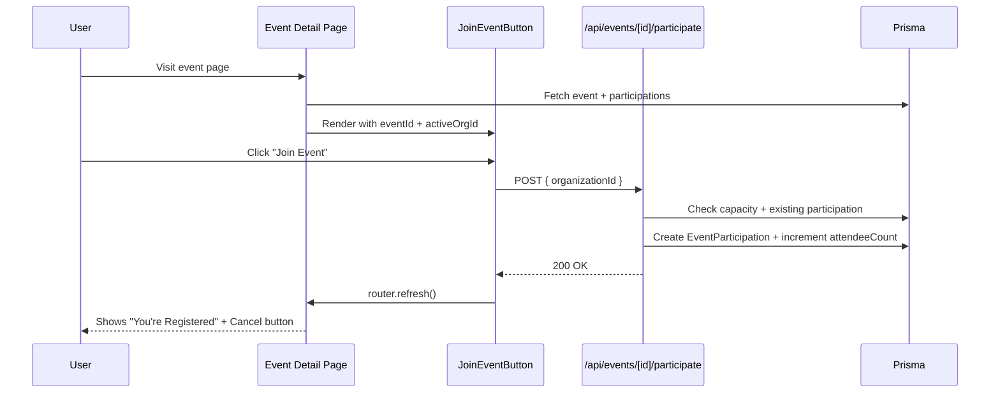

# Participation Flow — Walkthrough

## What Was Built

### New Components

| File | Purpose |
|------|---------|
| [JoinEventButton.tsx](file:///d:/evently/components/shared/JoinEventButton.tsx) | Client component for joining events. Handles login redirect, full-capacity state, loading state, and error display. Passes `activeOrganizationId` to the API. |
| [CancelParticipationButton.tsx](file:///d:/evently/components/shared/CancelParticipationButton.tsx) | Client component with a confirmation `AlertDialog` before cancelling. Prevents accidental cancellations. |
| [EventParticipantsPanel.tsx](file:///d:/evently/components/shared/EventParticipantsPanel.tsx) | Server component showing registered/attended participants with org logos, user avatars, and status badges. Host view reveals email addresses. |

### New Pages

| File | Purpose |
|------|---------|
| [my-events/page.tsx](file:///d:/evently/app/(protected)/my-events/page.tsx) | User participation history with **Upcoming / Past / Cancelled** tabs. Each event card shows status badge, date, location, and inline cancel button for upcoming events. |

### Updated Files

| File | Change |
|------|--------|
| [events/[id]/page.tsx](file:///d:/evently/app/(protected)/events/[id]/page.tsx) | Replaced raw HTML forms with `JoinEventButton`, `CancelParticipationButton`, and `EventParticipantsPanel`. Added host badge. Fetches `activeOrganizationId` for participation. |
| [participate/route.ts](file:///d:/evently/app/api/events/[id]/participate/route.ts) | Fixed Next.js 15 `params: Promise<{id}>` type. POST now reads `organizationId` from request body (falls back to user's active org). DELETE revalidates `/my-events`. |
| [constants/index.ts](file:///d:/evently/constants/index.ts) | Added **Events** and **My Events** nav links. Removed unused About/Profile links. |

---

## Next.js 15 Params Fix (Bonus)

While fixing the participate route, all other API routes and pages with the old `params: { id: string }` pattern were updated to `params: Promise<{ id: string }>` as required by Next.js 15:

- `api/events/[id]/route.ts` — PUT, DELETE
- `api/invitations/[id]/accept/route.ts` — POST
- `api/invitations/[id]/decline/route.ts` — POST
- `api/organizations/[id]/route.ts` — PUT, DELETE
- `api/organizations/[id]/members/route.ts` — POST
- `api/organizations/[id]/members/[memberId]/route.ts` — PUT, DELETE
- `app/invite/[token]/page.tsx`
- `app/(protected)/events/[id]/page.tsx`
- `app/(protected)/events/page.tsx` — searchParams
- `app/(protected)/organizations/[id]/edit/page.tsx`
- `app/(protected)/organizations/[id]/members/page.tsx`

---

## Participation Flow — How It Works

---

## TypeScript Status

After all fixes, `npx tsc --noEmit` shows only **4 pre-existing errors** unrelated to participation:

| File | Error | Status |
|------|-------|--------|
| `__tests__/sample.test.ts` | Missing jest-dom types | Pre-existing |
| `api/organizations/route.ts` | Prisma `industryId` type conflict | Pre-existing |
| `components/shared/Navbar.tsx` | Image src null check | Pre-existing |
| `data/two-factor-token.ts` | Prisma unique input mismatch | Pre-existing |

---

## Task.md Update

Phase 3 items marked complete in [docs/task.md](file:///d:/evently/docs/task.md):
- ✅ Join/RSVP to events
- ✅ Cancel participation  
- ✅ Participation history for users (`/my-events`)
- ✅ Track org participation (via `organizationId` on `EventParticipation`)
- ✅ Store participation metadata
- ⏸️ Save event for later — deferred (requires new schema table)
